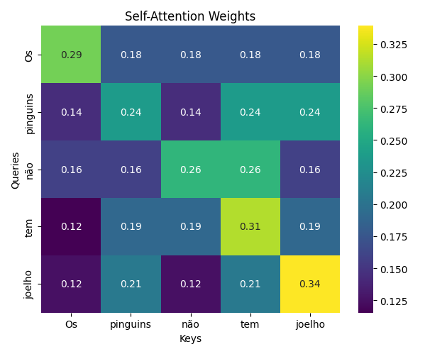
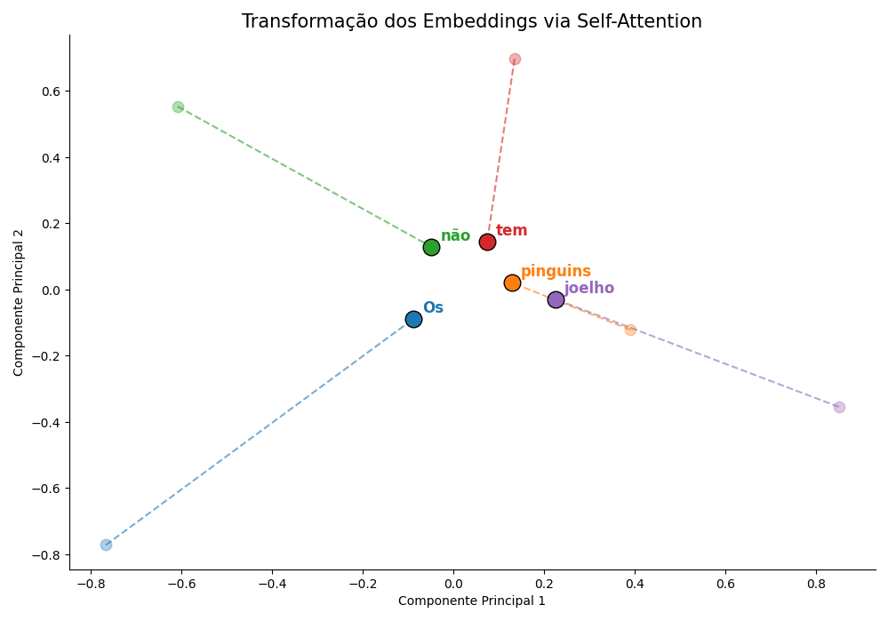

# Implementação do Mecanismo de Self-Attention
## **Descrição**
Este projeto implementa o mecanismo de Scaled Dot-Product Attention, conforme descrito no paper [*Attention Is All You Need* (Vaswani et al., 2017)](https://arxiv.org/abs/1706.03762).


A implementação foi feita utilizando apenas NumPy, sem bibliotecas de alto nível de Deep Learning, conforme exigido no laboratório.

A fórmula implementada é:
$$
\text{Attention}(Q, K, V) =
\text{softmax}\left(\frac{QK^T}{\sqrt{d_k}}\right)V
$$

## **🧠 Funcionamento Matemático**
O mecanismo executa as seguintes etapas:

### **Produto Escalar**

$$
S = QK^T
$$


Mede a similaridade entre queries e keys.

### **Fator de Escala**

$$
\hat{S} = \frac{S}{\sqrt{d_k}}
$$


A divisão por √dk evita que os valores cresçam excessivamente, o que poderia saturar o softmax e prejudicar o treinamento.

### **Softmax**

Cada linha é normalizada para formar uma distribuição de probabilidade.
$$
A_{ij} =
\frac{e^{\hat{S}_{ij}}}
{\sum_{j=1}^{n} e^{\hat{S}_{ij}}}
$$


### **Combinação Ponderada**

$$
\text{Output} = A V
$$

Gera os embeddings contextuais finais.

## **⚙️ Requisitos**
Criar ambiente virtual e instalar dependências:
```bash
python3 -m venv .venv
source .venv/bin/activate
pip install numpy matplotlib seaborn

```
## **▶️ Como Executar**
```bash
python test_attention.py
```
O script executa:

- Um exemplo com frase tokenizada

- Visualização em heatmap da matriz de atenção

## **🔍 Visualização**
O projeto também plota:

- Matriz de pesos de atenção (n × n)

Isso permite interpretar como cada token distribui sua atenção entre os demais.

## **📎 Estrutura do Projeto**
```bash
implementando-self-attention/
│
├── img
├── attention.py
├── test_attention.py
├── README.md
└── requirements.txt
```

## **🎯 Objetivo Acadêmico**
Este projeto tem como finalidade compreender profundamente:

- Produto escalar entre vetores

- Normalização por √dk

- Softmax linha por linha

- Mistura contextual via multiplicação por V


## **🧠 Explicando o Exemplo**

Foi utilizada a frase:

> "Os pinguins não tem joelho"

Inicialmente, foi realizada a tokenização da frase, gerando os seguintes tokens:
```py
["Os", "pinguins", "não", "tem", "joelho"]
```

Em seguida, foi simulado um embedding vetorial para cada palavra.

Em um cenário real, esses embeddings seriam obtidos por modelos pré-treinados, como Word2Vec, GloVe ou embeddings aprendidos diretamente durante o treinamento de um Transformer. Esses modelos são treinados com grandes volumes de dados e capturam relações semânticas reais.

Neste projeto, os valores das matrizes foram definidos de forma proposital para gerar uma estrutura lógica coerente com a semântica da frase.

## **📊 Matriz de Attention Weights**

Após a aplicação do mecanismo de self-attention, obteve-se a seguinte matriz de pesos:

```python
attention_weights = 
[[0.29187513 0.17703122 0.17703122 0.17703122 0.17703122]
 [0.14396436 0.2373571  0.14396436 0.2373571  0.2373571 ]
 [0.15879462 0.15879462 0.26180807 0.26180807 0.15879462]
 [0.11541419 0.19028583 0.19028583 0.3137283  0.19028583]
 [0.12475479 0.20568587 0.12475479 0.20568587 0.33911868]]
```

A visualização gráfica pode ser observada em:


Cada linha representa a distribuição de atenção de um token (Query) em relação aos demais tokens (Keys).

### **🔎 Interpretação Linha por Linha**
#### **"Os"**

Distribuição:
```py
[0.29, 0.18, 0.18, 0.18, 0.18]
```

- Forte autoatenção.

- Distribuição quase uniforme para os demais tokens.

- Comportamento neutro e estruturalmente esperado para artigo definido.

#### **"pinguins"**

Distribuição:
``` py
[0.14, 0.24, 0.14, 0.24, 0.24]
```

- Atenção relevante em si mesmo.

- Atenção significativa em:

    - "tem"

    - "joelho"

Isso é estruturalmente coerente, pois:

- "pinguins" é o sujeito da frase.

- Está ligado ao verbo "tem".

- Está semanticamente relacionado ao objeto "joelho".

#### **"não"**

Distribuição:
```py
[0.16, 0.16, 0.26, 0.26, 0.16]
```

- Divide atenção entre si mesmo e "tem".

- Linguisticamente coerente, pois "não" modifica o verbo "tem".

- Isso demonstra que a similaridade vetorial capturou uma relação sintática relevante.

#### **"tem"**

Distribuição:
```py
[0.12, 0.19, 0.19, 0.31, 0.19]
```

- Forte autoatenção.

- Atenção distribuída entre:

    - "pinguins"

    - "não"

    - "joelho"

Isso representa o verbo conectando sujeito e objeto.

#### **"joelho"**

Distribuição:
```py
[0.12, 0.21, 0.12, 0.21, 0.34]
```

- Forte autoatenção.

- Atenção relevante em:

    - "pinguins"

    - "tem"

Novamente coerente com a estrutura sintática da frase.

### **🧠 Observação Importante**

É importante destacar que, neste experimento:

- Não houve treinamento.

- Não houve aprendizado de parâmetros.

- Não foram utilizadas matrizes W_Q, W_K e W_V aprendíveis.

A estrutura observada é resultado da geometria do espaço vetorial definido manualmente.

Em modelos Transformer reais, o aprendizado ajusta esse espaço vetorial por meio de backpropagation, permitindo que o mecanismo de atenção capture relações linguísticas complexas.

### **Conclusão do Exemplo**

Este experimento demonstra que o mecanismo de self-attention:

1. Mede similaridade vetorial.

2. Converte similaridade em probabilidades.

3. Gera representações contextuais a partir de combinações ponderadas.

Mesmo sem treinamento, já é possível observar padrões coerentes com a estrutura sintática da frase.

## 🔎 Curiosidade: Organização no Espaço Vetorial

Para ilustrar o efeito do self-attention, projetei os embeddings iniciais e os embeddings contextuais finais em duas dimensões utilizando PCA.



No gráfico, cada palavra possui:

- Um ponto inicial (embedding estático).
- Um ponto final (embedding após self-attention).
- Uma linha indicando o deslocamento no espaço vetorial.

Essa visualização mostra como o mecanismo de atenção reorganiza geometricamente os vetores.

Após a aplicação do self-attention, observa-se que:

- Palavras estruturalmente relacionadas tendem a se aproximar.
- A representação vetorial torna-se mais contextual.
- O espaço passa a refletir relações sintáticas da frase.

É importante destacar que essa organização não representa semântica aprendida, pois não houve treinamento do modelo. 

Em modelos Transformer reais, esse deslocamento vetorial é resultado do aprendizado das matrizes \( W_Q, W_K, W_V \), permitindo que relações linguísticas complexas sejam codificadas geometricamente no espaço vetorial.


## **📚 Referências**

- Vaswani, A., Shazeer, N., Parmar, N., Uszkoreit, J., Jones, L., Gomez, A.N., Kaiser, Ł., & Polosukhin, I. (2017). *Attention Is All You Need*.  
  📄 https://arxiv.org/abs/1706.03762

- Romero, Daniel. *Explicação completa do modelo Transformer com base no paper: Attention Is All You Need*.  
  🎥 https://www.youtube.com/watch?v=aCWm4eMQlQs

